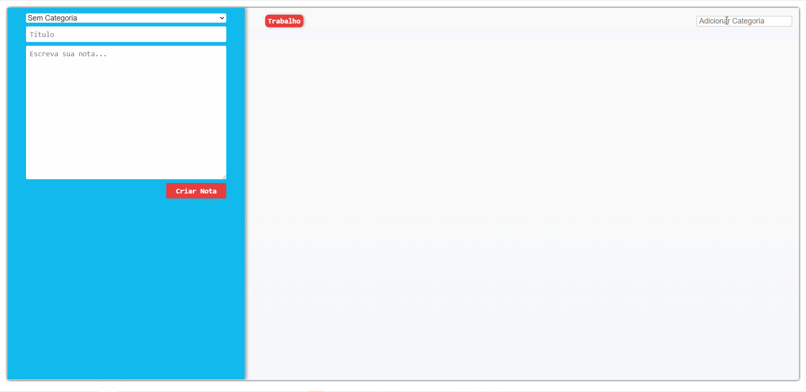

# Projeto Alura 

Esse projeto foi a primeira aplicação feita no curso de `React` na ALura Cursos

---

## Aprendizado

Na construção desta simples Lista de Tarefas, adquiri conhecimentos
em diversos pontos da Biblioteca `React`. Entre eles estão:
- Ciclo de vida dos componentes React
- Diferença entre Statefull e Stateless components
- Como funciona o  `this` dentro do JavaScript, por consequência a necessidade do `bind`.
- Funções passadas por propriedade e gerenciamento estado

---
Sendo apenas o primeiro módulo do Curso, essa aplicação ainda contará com atualizações, incrementos de funcionalidades, aprimoramento de layout e melhorias de desempenho. 

